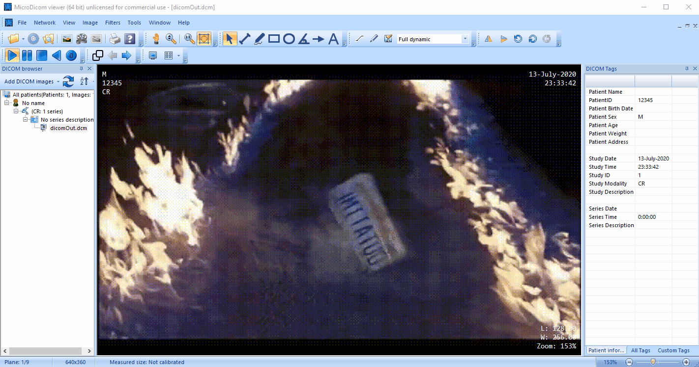

Multipurpose DICOM Converter (name WIP)
==============================================

# Goal
- Create a utility that converts any moving picture file into DICOM for easy and fun test image generation for medical software.
- Be cross-platform because we can
- Provide this as a web service one day

# Supported Formats
1. GIF
1. MP4
1. AVI

# Getting Started
1. Install [FFMPEG](http://ffmpeg.org/download.html) and make sure it's added to your path
1. Acquire a file in any format above from your favorite source (i.e. https://www.reddit.com/r/cinemagraphs)
1. Build the solution
1. In a command prompt, `cd` to the bin folder

# Usage & Examples
Generate a DICOM file from an `mp4` on Windows:

`.\XToDicom.Cli.exe --in C:\sample.mp4 --out C:\dicomOut.dcm`

Then, open it up with any free DICOM viewer (for example, [MicroDICOM](https://www.microdicom.com/)) and it should look something like this:

> Creator credit: Reddit user [InfinitySandwich's post](https://www.reddit.com/r/Cinemagraphs/comments/hl8shw/where_we_are_going_we_dont_need_roads_first_time/)

> Generated from a scene in the movie Back to the Future

TODO: Linux & MacOS instructions

TODO: Build a pre-packaged binary in GitHub releases or publish a `dotnet tool install` compatible nuget package.